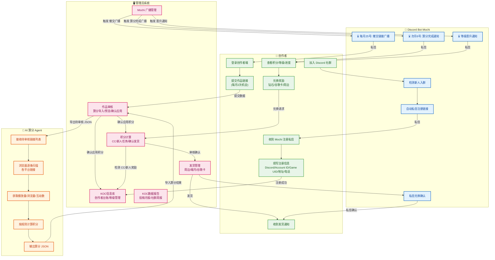
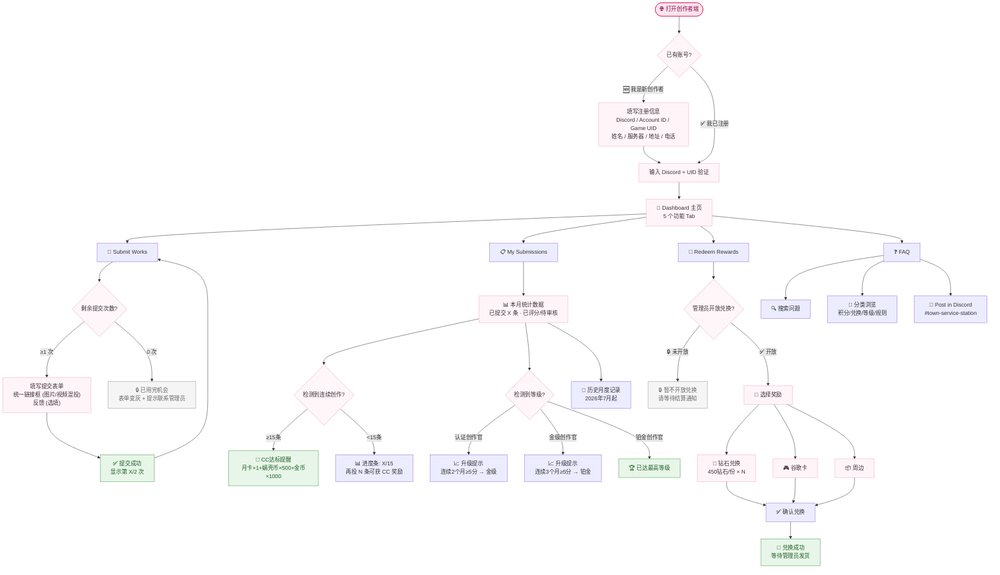
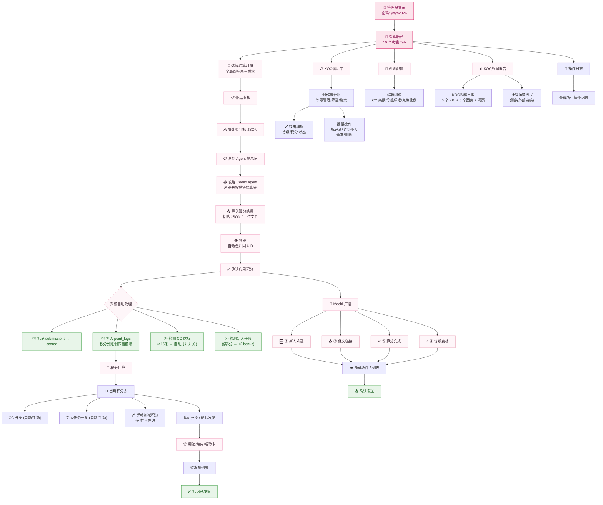
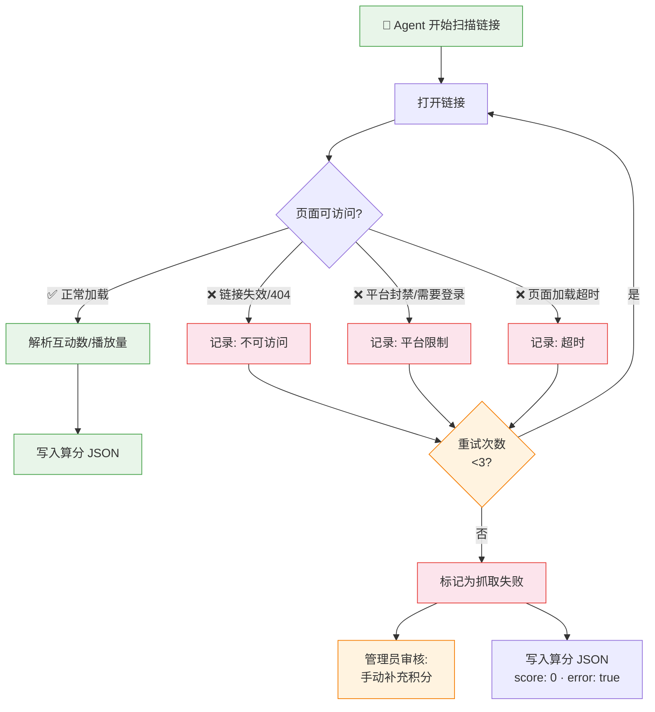
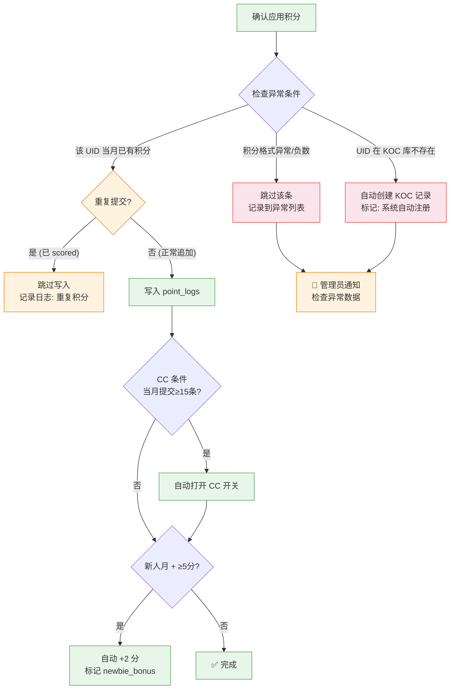
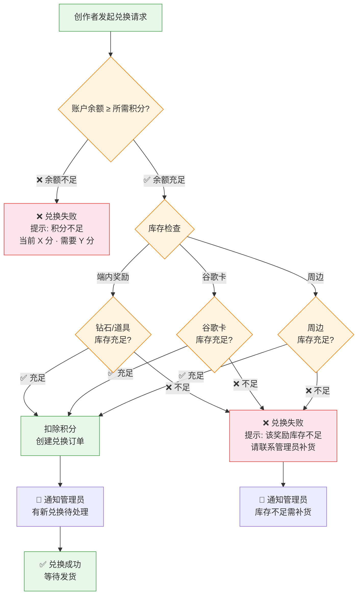
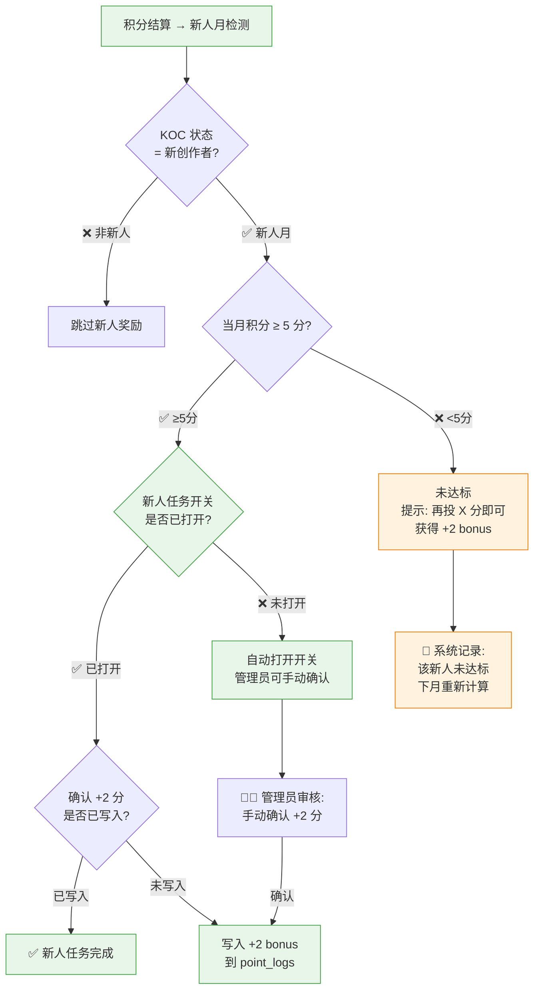
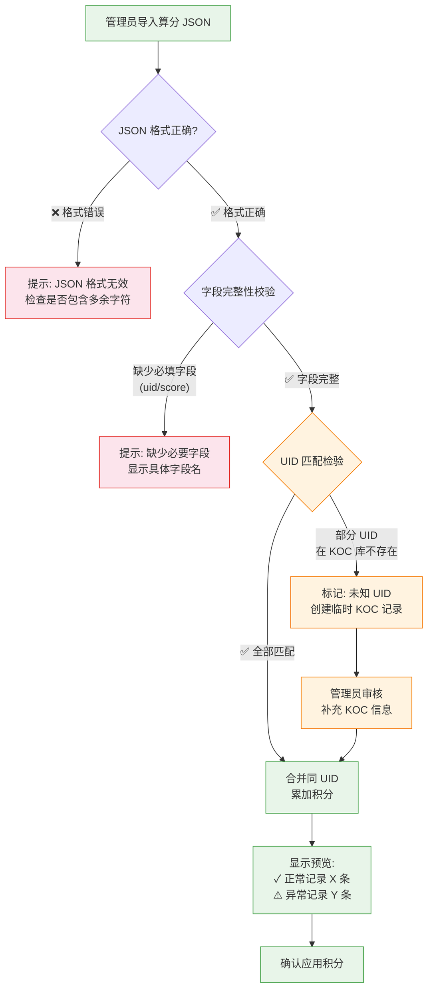

# Yoyo KOC Creator Management System — 核心流程图 v2.0

---

## 一、业务主流程图（泳道图）

**覆盖范围**: 新人注册 → 投稿 → 月度结算 → 积分兑换 → 发货全链路
**角色**: 创作者 / Discord 机器人 Mochi / 管理员系统 / AI 算分 Agent



---

## 二、页面操作流程图（用户操作路径）

### 2.1 创作者端操作路径



### 2.2 管理后台操作路径



---

## 三、异常分支流程图

### 3.1 投稿数据抓取失败



### 3.2 积分计算异常



### 3.3 重复投稿

```mermaid
flowchart TD
    START["创作者提交链接"] --> CHECK_LIMIT{"剩余次数 > 0?"}
    
    CHECK_LIMIT -->|"❌ 0 次"| REJECT["拒绝提交<br>提示: 已用完 2 次机会<br>请联系管理员"]
    CHECK_LIMIT -->|"✅ ≥1 次"| CHECK_LINKS["检测链接内容"]
    
    CHECK_LINKS --> CHECK_DUP{"与历史提交<br>存在完全相同的 URL?"}
    
    CHECK_DUP -->|"是"| DUP_ALERT["提示: 该链接已提交过<br>请检查后重试"]
    CHECK_DUP -->|"否"| CHECK_BLANK{"链接框为空?"}
    
    CHECK_BLANK -->|"是"| EMPTY_ALERT["提示: 请粘贴作品链接"]
    CHECK_BLANK -->|"否"| SAVE["✅ 保存提交<br>写入 submissions 表"]
    
    DUP_ALERT --> START
    EMPTY_ALERT --> START
    
    SAVE --> DEDUCT["扣除 1 次提交机会"]
    DEDUCT -> DONE["显示成功状态"]

    classDef normal fill:#e8f5e9,stroke:#43a047
    classDef error fill:#fce4ec,stroke:#e53935
    classDef warn fill:#fff3e0,stroke:#f57c00
    class START,SAVE,DEDUCT,DONE normal
    class REJECT error
    class CHECK_DUP,DUP_ALERT,CHECK_BLANK,EMPTY_ALERT warn
```

### 3.4 兑换库存不足 / 余额不足



### 3.5 新人奖励不达标



### 3.6 算分导入数据格式异常



---

*文档版本: v2.0 | 日期: 2026-07-20*
