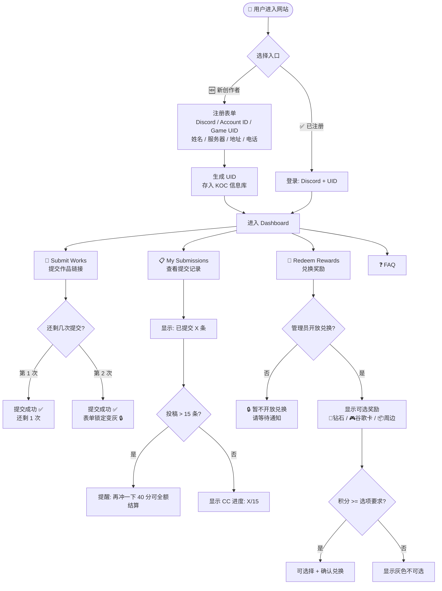
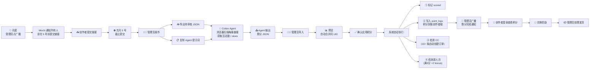
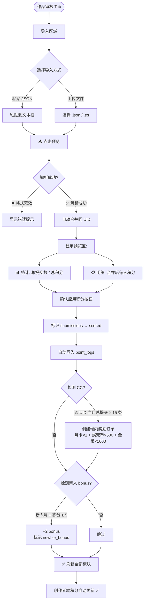
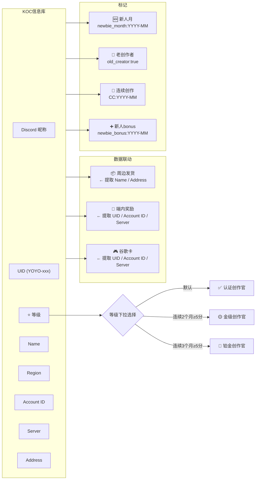
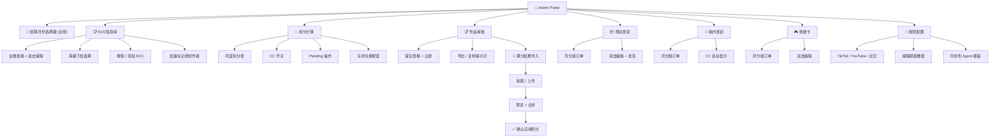
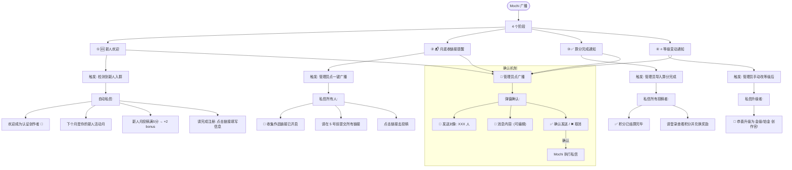
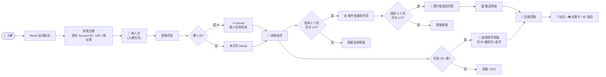
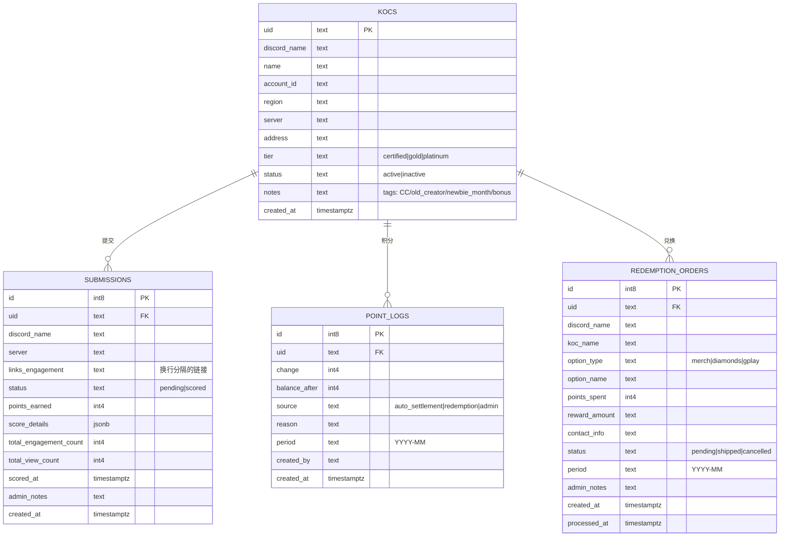

# Yoyo KOC Exchange — 核心流程图

---

## 1. 创作者端架构

---

## 2. 月度结算核心流程 (完整闭环)

---

## 3. 算分导入模块 (作品审核页) 详细流程

---

## 4. KOC 信息库 & 等级体系

---

## 5. 管理员 Tab 导航

---

## 6. Mochi 广播流程

---

## 7. 创作者完整生命周期

---

## 8. 数据库关系图

